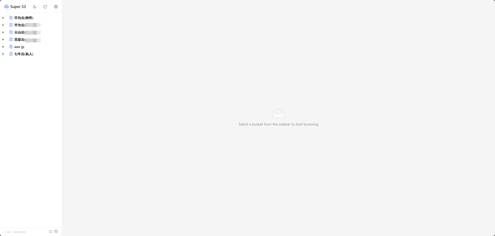
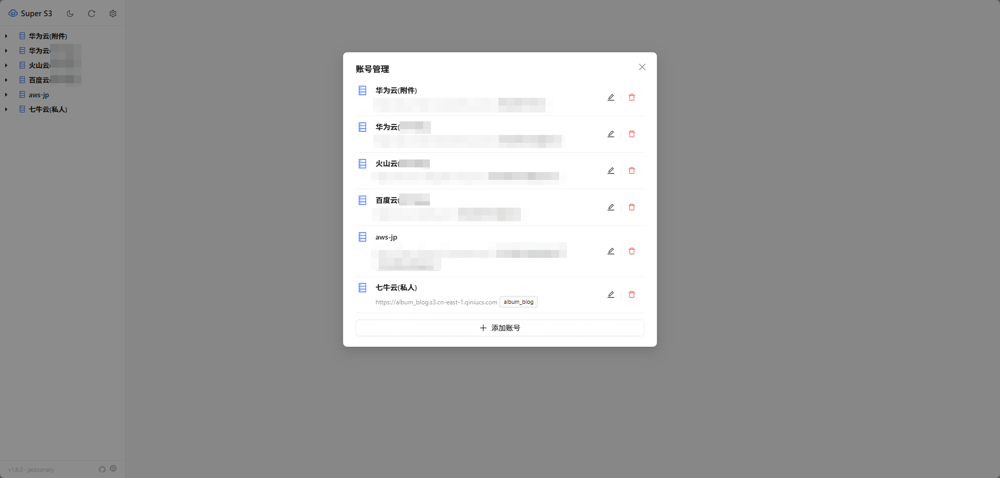
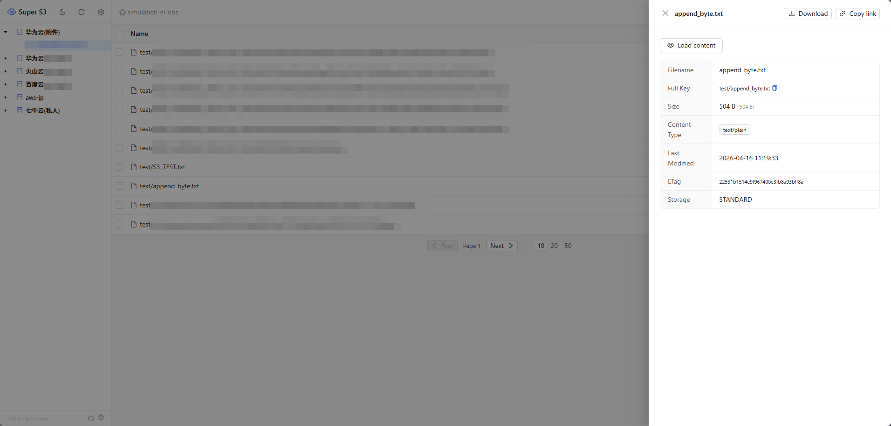

[English](README.md) | [简体中文](README.zh-CN.md)

# Super S3 Desktop

A cross-cloud object storage management desktop client compatible with any S3-compliant service — including AWS S3, Huawei Cloud OBS, Alibaba Cloud OSS, Volcengine TOS, Baidu Cloud BOS, Tencent Cloud COS, Qiniu Kodo, MinIO, and more.

Built with [Tauri 2](https://v2.tauri.app/) + Rust + React. No Docker, no server deployment — just download and run.

**Repository**: [GitHub](https://github.com/Jacksonary/super-s3) | [Gitee](https://gitee.com/weiguoliu/super-s3)

## Screenshots

| Main Interface | Account Management | Object Details |
|---|---|---|
|  |  |  |

## Features

### Multi-Account Management
- Configure an unlimited number of cloud accounts, displayed in a sidebar tree view
- Add, edit, and delete accounts directly within the app — no manual config file editing
- Automatic cloud provider detection based on endpoint (Huawei OBS, Alibaba OSS, Volcengine TOS, etc.)

### File Browsing
- Virtual folder hierarchy with breadcrumb navigation
- Paginated browsing (10 / 20 / 50 items per page) with cursor-based pagination — consistent performance at any depth
- Prefix-based search without full bucket scanning; search results support pagination

### File Operations
- **Upload**: Select files via system dialog or drag-and-drop; supports multiple files
- **Download**: Choose a local path through the system save dialog; streams directly from S3 to disk
- **Delete**: Single or batch delete with checkbox selection; folders are recursively removed
- **Create Folder**: Create virtual directories
- **Pre-signed URL**: Generate time-limited download links (default: 1 hour) and copy to clipboard

### File Preview
- Images: Inline display with full-screen zoom
- Audio / Video: Native player
- Text / Code: Full content loading with one-click copy and in-place editing with save-back
- Complete metadata view (size, Content-Type, last modified, expiration, ETag, custom metadata)

### Theming
- Light / Dark mode toggle with automatic preference persistence

## Download

Head to [GitHub Releases](https://github.com/Jacksonary/super-s3/releases) or [Gitee Releases](https://gitee.com/weiguoliu/super-s3/releases) to grab the installer for your platform:

| Platform | Format |
|---|---|
| Windows 64-bit | `.exe` (NSIS) / `.msi` |
| Linux | `.deb` / `.rpm` / `.AppImage` |
| macOS (Apple Silicon only) | `.dmg` |

> For Linux AppImage, no installation is required — just make it executable and run:
> `chmod +x Super\ S3_*.AppImage && ./Super\ S3_*.AppImage`

> **macOS**: only Apple Silicon (M-series) Macs are supported; Intel Macs are not built. The app isn't code-signed/notarized, so Gatekeeper will report it as "damaged" on first launch. Remove the quarantine attribute to fix it:
> ```bash
> xattr -cr "/Applications/Super S3.app"
> ```

## Configuration

On first launch the account list is empty. Click the gear icon in the sidebar to add an account. Configuration is automatically saved to the system application data directory:

| OS | Path |
|---|---|
| Linux | `~/.config/super-s3/config.yaml` |
| macOS | `~/Library/Application Support/super-s3/config.yaml` |
| Windows | `%APPDATA%\super-s3\config.yaml` |

Configuration format (YAML list — one entry per cloud account):

```yaml
- name: "Huawei Cloud OBS"        # Optional; auto-detected if omitted
  ak: YOUR_ACCESS_KEY
  sk: YOUR_SECRET_KEY
  endpoint: "https://obs.cn-east-3.myhuaweicloud.com"
  region: cn-east-3
  buckets:                         # Leave empty to list all buckets
    - my-bucket-1

- name: "Alibaba Cloud OSS"
  ak: YOUR_ACCESS_KEY
  sk: YOUR_SECRET_KEY
  endpoint: "https://oss-cn-beijing.aliyuncs.com"
  region: oss-cn-beijing
  buckets: []
```

| Field | Required | Description |
|---|---|---|
| `ak` | Yes | Access Key ID |
| `sk` | Yes | Secret Access Key |
| `endpoint` | Yes | S3-compatible endpoint; can be left empty for AWS S3 |
| `region` | Yes | Region identifier |
| `name` | No | Display name; auto-detected from endpoint if omitted |
| `buckets` | No | Specific buckets to display; leave empty to list all |

## Common Endpoints

| Provider | Endpoint Format |
|---|---|
| AWS S3 | Leave empty or `https://s3.amazonaws.com` |
| Huawei Cloud OBS | `https://obs.{region}.myhuaweicloud.com` |
| Alibaba Cloud OSS | `https://oss-{region}.aliyuncs.com` |
| Volcengine TOS | `https://tos-s3-{region}.volces.com` |
| Baidu Cloud BOS | `https://s3.{region}.bcebos.com` |
| Tencent Cloud COS | `https://cos.{region}.myqcloud.com` |
| Qiniu Kodo | `https://s3-{region}.qiniucs.com` |
| MinIO | `http://your-host:9000` |

## Building from Source

```bash
# Prerequisites: Rust, Node.js, and Tauri system dependencies
# Linux: sudo apt install libwebkit2gtk-4.1-dev libjavascriptcoregtk-4.1-dev libsoup-3.0-dev librsvg2-dev libayatana-appindicator3-dev
# Tauri CLI: cargo install tauri-cli@^2

git clone https://github.com/Jacksonary/super-s3.git
cd super-s3
npm install
cargo tauri build
```

Build artifacts are located at `src-tauri/target/release/bundle/`.

## Tech Stack

| Layer | Technology |
|---|---|
| Framework | Tauri 2 |
| Backend | Rust + aws-sdk-s3 |
| Frontend | React 18 + TypeScript + Ant Design 5 |
| Build | Vite 5 + Cargo |

---

## License

This project is licensed under the [Apache License 2.0](LICENSE).

## Buy Me a Beer

If you find this project helpful, feel free to buy the author a beer 🍺

<p align="center">
  <table align="center"><tr>
    <td align="center">
      <br>WeChat
    </td>
    <td width="60"></td>
    <td align="center">
      <br>Alipay
    </td>
  </tr></table>
</p>
